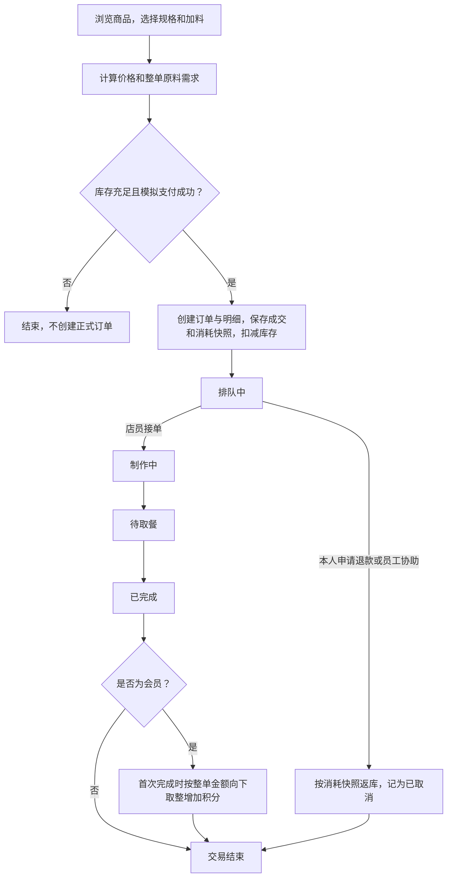

# 蜜雪冰城单门店数据库课程项目

## 项目范围

本项目使用 SQL Server 实现单个奶茶门店的销售与管理数据库，覆盖商品、配方、原料库存、温度／糖度／杯型、加料、订单与明细、会员、员工和值班，以及经营查询和统计视图。

数据库包含15张业务表，初始化样例共232条。角色脚本另建1张身份绑定辅助表，用于限制购买者访问本人数据。关系模式见[数据字典](docs/第二周关系模式与数据字典.md)，表与联系见[ER图](ER图_修订版.png)。

商品配置、正式订单、成交价格与原料消耗快照、库存、会员和员工值班信息进入数据库。付款前的购买方案作为临时输入，游客只记录购买身份，不保存姓名和手机号。本阶段暂不覆盖总部、采购供应商、配送、非订单损耗及复杂薪资结算；支付采用模拟结果，操作通过SQL完成。

## 业务角色

| 业务角色 | 数据库角色与演示用户 | 允许的主要操作 | 权限限制 |
| --- | --- | --- | --- |
| 顾客 | `teabar_customer`；`demo_guest_a/b` | 浏览、本人下单、查询本人订单、本人排队订单退款 | 不能读取全部订单、会员资料或操作他人订单 |
| 会员 | `teabar_member`；`demo_member_a/b` | 顾客购买能力，以及查询本人资料、积分与消费记录 | 不能读取会员名单或直接修改积分 |
| 店员 | `teabar_clerk`；`demo_clerk` | 查询当天订单及全部未完成订单、推进制作与交付、协助退款、登记和更正会员资料 | 不能改价、补库、查员工工资或经营统计 |
| 店长 | `teabar_manager`；`demo_manager` | 店员工作能力，以及管理商品、库存、配置、员工与值班，查询历史订单和经营统计 | 不能直接修改历史快照、物理删除核心记录或授予数据库权限 |

业务查询与写入通过 `teabar_api` 视图和存储过程执行。身份绑定及数据库授权由管理员维护；员工表中的岗位、在职状态与数据库角色成员关系分别维护。

`role.sql` 通过 `EXECUTE AS USER` 切换六个演示用户，验证正常操作、本人数据范围和越权拒绝。它们是 `WITHOUT LOGIN` 数据库用户，无需分别登录SSMS。查看结果中的 `user_name`，结合上表即可确定实际测试角色。

## 业务流程



正式订单、明细、快照与扣库一起提交；排队中允许退款，制作开始后不再允许退款。完成订单不返库，重复完成不重复增加积分。订单按创建时间匹配当时全部值班员工，用于查询团队归属。

## 脚本执行顺序与复现步骤

1. 使用SSMS连接SQL Server，以数据库管理员身份执行。本机实例为 `localhost`，使用Windows身份验证；其他电脑填写自己的实例名。
2. 打开项目根目录的SQL文件，每个文件使用新查询窗口，不选中局部文字，按F5完整执行。
3. 按下表依次运行，每一步检查“结果”和“消息”。出现未捕获错误时处理后再继续。

**`db_creation.sql` 会删除并重建已有TeabarDB，只在首次初始化或需要重置课程数据时执行。**

| 顺序 | 脚本 | 作用与预期结果 |
| --- | --- | --- |
| 1 | [db_creation.sql](db_creation.sql) | 创建TeabarDB和15张空业务表 |
| 2 | [seed_data.sql](seed_data.sql) | 向空表装载样例，消息显示15张表、232条记录 |
| 3 | [constraint.sql](constraint.sql) | 安装完整性约束，44项正反例全部通过 |
| 4 | [role.sql](role.sql) | 安装四种角色、六个用户、身份绑定与业务接口，84项验证全部通过 |
| 5 | [view.sql](view.sql) | 创建13个 `dbo` 正式视图并查询验证 |
| 6 | [query.sql](query.sql) | 执行Q01—Q18商品、库存、订单、会员、值班及经营查询 |
| 7 | [crud_demo.sql](crud_demo.sql) | 演示增删改查、取消返库、完成与积分，结束回滚 |
| 8 | [query.sql](query.sql) | 再次查询，核对业务样例恢复 |
| 9 | [view_demo.sql](view_demo.sql) | 补充演示视图创建、修改和删除，依次返回4行、2行、“已删除” |
| 10 | [query_demo.sql](query_demo.sql) | 补充展示关键词、时间范围及每日经营统计 |

`query.sql` 的Q17、Q18及 `query_demo.sql` 依赖正式视图，应先执行 `view.sql`。角色安装后共有16张物理表；13个正式视图只指 `dbo` 下的视图，角色接口另有视图。

复现时检查以下基准结果：

- 样例：商品4条、原料9条、订单5条、明细7条。
- 约束及角色：`passed_cases` 分别为44和84。反例中的预期与实际错误号一致且 `result` 为“通过”，表示非法或越权操作被正确拒绝。
- CRUD：P001改价6→7元；I001补库后5200g，下单后5075g，取消后5200g；M001完成20元订单后积分120→140，重复完成更新0行。
- CRUD回滚后：P001为6元且在售，I001为5000g，M001为120分，CO001和CO002不存在。
- 经营统计：样例日期 `2026-10-04` 为3单、5杯、46元，平均客单价15.33元；“奶茶”范围内合计4杯、40元。

约束与角色脚本保留安装对象，回滚验证数据；CRUD回滚演示修改；视图演示删除专用测试视图。重复展示时运行对应演示脚本即可，`seed_data.sql` 不能在已有样例上重复装载。截图从执行后保留的结果窗格选取，不要仅执行事务内的局部写入语句。

详细操作和检查SQL见[复现与截图清单](docs/脚本复现与截图清单.md)。

## 文件与结果目录

```text
lab-implement/
├─ README.md                  项目说明与复现入口
├─ *.sql                      建库、样例、约束、角色、视图、查询及演示脚本
├─ ER图_修订版.png            当前ER图
├─ docs/                      阶段报告、数据字典与实验说明
└─ figure/                    实验截图
   ├─ README.md               截图索引与要求对应关系
   ├─ setup/                  成功建库与样例装载
   ├─ crud/                   增删改查、扣返库与积分
   ├─ constraint/             正常与非法数据验证
   ├─ role/                   角色业务操作与验证汇总
   ├─ view/                   视图创建、维护与统计
   └─ query/                  关键查询与经营统计
```

阶段报告见[第一阶段报告](docs/第一阶段报告.md)。现有19张截图及其对应实验见[结果目录](figure/README.md)，包含成功建库、正常及非法数据、CRUD、角色操作、视图和关键查询。角色越权拒绝的可见明细截图仍需补充，具体位置见结果目录。

补充设计说明：[完整性约束](docs/constraint.md)、[角色权限](docs/role.md)、[查询](docs/第四周查询.md)、[视图](docs/第四周视图.md)。已知设计校验缺口记录在[ER图核对记录](docs/ER图与当前设计核对.md)。

AI辅助实现、审查、确认规则及已有验证结果见[AI使用记录](docs/ai_log.md)。

SQL、Markdown文档、当前ER图及 `figure/` 截图纳入提交范围。课程任务原件、旧图、需求讨论和绘图中间文件保留在本地，由 `.gitignore` 排除。
