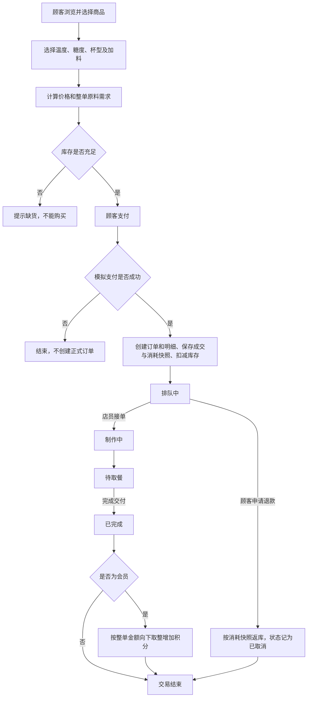
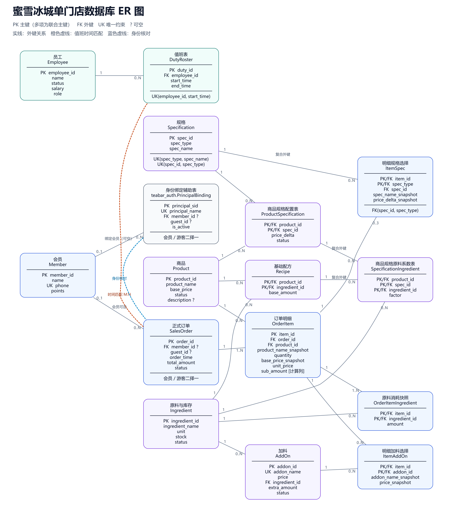

# 蜜雪冰城单门店数据库第一阶段报告

本阶段以奶茶门店经营为场景，完成数据库设计、建库、样例装载、增删改查、查询与视图，以及完整性约束和角色权限验证。

## 一 设计思路

### 经营场景与业务流程

系统面向单个门店。上图覆盖选择配置、支付、扣库、退款、制作交付与积分结算。订单与明细、快照及扣库在支付成功后一起保存；排队阶段允许退款，制作开始后不再允许退款；积分在会员订单首次完成时结算。

商品、原料库存、配方、规格、加料、正式订单及明细、会员和员工值班信息进入数据库，因为它们是交易处理、库存管理和经营统计的依据。购买时的价格与原料消耗保存为快照，保证改价或调整配方后仍能正确查询历史和返库。

付款前的购买方案只作临时输入，避免产生未付款的正式订单。游客不保存姓名、手机号，只用临时身份区分本人订单。总部、供应商、采购、配送、非订单损耗和复杂薪资结算暂不进入数据库，因为本阶段重点是单门店销售流程；支付采用模拟结果。

### 表与码的设计

上图已按完整安装后的结构核对，展示15张业务表及1张灰色的身份绑定辅助表。PK、UK、FK分别表示主码、唯一约束和外码；橙色虚线表示值班时间匹配，蓝色虚线表示本人身份核对。游客归属guest_id、配方复合外码和小计计算列已标出。图中每条明细至少一条消耗快照的业务下限仍需完善逐明细检查，见[ER图核对记录](ER图与当前设计核对.md)。

共设计15张业务表。商品、原料、规格、加料、会员和员工分别建表，保存各对象自身的属性；订单与明细分开，一笔订单可以包含多种商品。配方联系商品和原料，库存记录在原料表中，由实际原料需求判断能否购买。员工值班单独记录，按订单创建时间匹配当时的多人团队。

商品规格配置、规格原料系数、明细规格选择和明细加料选择分别建表，区分“商品允许的配置”和“实际购买的选择”。规格按系数调整基础配方，加料独立增加原料；消耗快照表保存最终扣减量。

主码方面，商品、订单、会员等使用各自编号，便于稳定标识和引用。联系表使用联合主码，例如Recipe的“商品编号 + 原料编号”防止重复配方行，ItemSpec的“明细编号 + 规格类型”保证同一明细每种类型最多选一项。

候选码方面，会员手机号、加料名称和规格的“类型 + 名称”均设置UNIQUE，因为这些属性也能唯一识别相应记录。Specification额外设置“编号 + 类型”的唯一约束以供复合外码引用；编号本身已是主码，因此这一组合不是最小候选码。

外码方面，明细引用订单和商品，配方引用商品和原料，值班记录引用员工，规格与加料选择引用对应定义。规格原料规则还通过“商品 + 原料”引用配方，防止调整商品配方中不存在的原料。外码保证关联对象存在，避免产生孤立记录。

### 完整性约束与角色权限

主码防止重复标识，UNIQUE保证候选码唯一，外码保证引用有效。必填字段设置NOT NULL；CHECK限制杯数为正整数、库存与积分非负、状态属于规定集合、值班结束晚于开始。明细数量默认1，商品默认下架，商品规格默认停用。明细小计采用计算列，避免手工填写错误；订单必须且只能归属会员或游客之一。

跨表金额汇总、规格必选、库存扣返、状态流转和积分结算通过受控业务操作实现。角色按职责授予最小权限，业务角色不能直接任意修改业务表。

| 角色 | 允许的操作 | 主要限制 |
| --- | --- | --- |
| 顾客 | 浏览、本人下单、查本人订单及合法退款 | 不能访问其他游客订单 |
| 会员 | 顾客能力、查本人资料与积分 | 不能访问其他会员资料或自行改积分 |
| 店员 | 处理当天及全部未完成订单、登记会员 | 不能改价、补库或查看员工工资 |
| 店长 | 管理商品、库存、配置、员工和值班，查经营数据 | 不能直接改历史快照或授予数据库权限 |

## 二 实验过程

在SQL Server独立空库中，依次执行db_creation.sql、seed_data.sql、constraint.sql、role.sql、view.sql和query.sql，再运行crud_demo.sql并重新查询。建库和装载得到15张业务表、232条样例。以下按CRUD、VIEW、CONSTRAINT、ROLE和QUERY五类说明实验作用，列出的结果来自2026年10月6日的复现及项目已保存的验证记录。

现场执行截图按类别整理在[结果目录](../figure/README.md)，可对照下面各项实验查看。

### CRUD 数据增删改查

使用[crud_demo.sql](../crud_demo.sql)验证商品、原料和订单数据的增删改查，以及修改前后的业务关联。演示由管理员在事务内执行，结束回滚；业务角色的日常操作权限在ROLE实验中另行验证。

| 实验样例 | 操作与输入 | 预期结果 | 实际结果 |
| --- | --- | --- | --- |
| 新增商品与原料 | 参考P001、I001创建CP001、CI001，再查询 | 新记录存在，原样例保留 | 两条测试记录可查询，原商品和原料保留 |
| 查询原始数据 | 查询P001、I001和M001 | 价格6元、柠檬库存5000g、积分120 | 分别返回6元、5000g、120分 |
| 商品修改 | P001改价6 → 7元，并下架、重新上架 | 改价成功；下架后不出现在在售列表，历史价格快照不变 | 当前价格7元；下架时在售查询为0行，重新上架后恢复可见，历史快照保留 |
| 扣库与取消返库 | I001补库至5200g；CO001购买2杯配置后的柠檬水，消耗柠檬125g，再取消 | 下单后5075g，取消后恢复5200g | 库存依次为5200g、5075g、5200g，订单变为已取消 |
| 完成与积分 | CO002为20元，从待取餐完成，随后重复完成 | M001增加20分；重复完成不再加分，完成不返库 | 积分120 → 140；重复完成更新0行，柠檬仍为5075g |
| 删除测试记录 | 先清理CO001子记录，再删除订单、CP001和CI001 | 被删除对象查询为空，原样例不删除 | 目标查询为0行，原样例保留 |
| 结束回滚 | 回滚整段CRUD事务 | 恢复原价格、库存和积分，移除测试订单 | P001为6元且在售，I001为5000g，M001为120分，测试订单不存在 |

### VIEW 视图创建与使用

使用[view.sql](../view.sql)将常用的连接和统计逻辑封装为13个视图，再用[view_demo.sql](../view_demo.sql)演示视图对象的创建、查询、修改定义和删除。视图方便重复查询，修改演示视图定义不会修改商品数据。

| 实验样例 | 操作与输入 | 预期结果 | 实际结果 |
| --- | --- | --- | --- |
| 创建正式视图 | 完整执行view.sql，再重复执行 | 13个视图创建成功，重复执行不重名报错 | 13个正式视图创建成功，重复执行通过 |
| 每日经营视图 | 查询2026-10-04的每日经营记录 | 汇总完成订单，不重复累计明细金额 | 返回1行：3单、5杯、46元，平均客单价15.33元 |
| 会员消费视图 | 查询全部会员的已完成消费 | 保留零消费会员，金额与订单一致 | 返回4名会员；M001为28元，M002为9元，M003和M004为0元 |
| 演示视图创建 | 创建vw_DemoProduct并查询全部商品 | 显示4条初始化商品 | 返回4行 |
| 演示视图修改 | ALTER VIEW筛选在售且基础价至少7元的商品 | 只保留符合条件的商品，基础表不变 | 返回珍珠奶茶、椰果奶茶共2行 |
| 演示视图删除 | DROP VIEW后检查对象是否存在 | 专用测试视图不存在，正式视图保留 | 显示“已删除”，13个正式视图保留 |

### CONSTRAINT 完整性约束

使用[constraint.sql](../constraint.sql)补充主码、外码、唯一、检查、默认值和非空约束，并分别执行合法及非法操作。反例同时核对实际错误号和目标约束，确认拒绝原因；测试数据最后回滚。

| 实验样例 | 操作与输入 | 预期结果 | 实际结果 |
| --- | --- | --- | --- |
| 默认值正例 | 新增商品、明细时省略状态和数量 | 商品默认下架，明细数量默认1 | 实际写入“下架”和1 |
| 主码与候选码反例 | 重复商品编号；两个会员使用同一手机号 | 分别由主码和唯一约束拒绝 | 两项均触发错误2627，目标约束匹配 |
| 外码反例 | 明细引用不存在的订单；规格规则引用商品配方外的原料 | 拒绝无效引用及不属于该商品的原料规则 | 两项均触发错误547，目标外码匹配 |
| 数量与库存反例 | 库存改为-1；明细数量改为0 | CHECK拒绝，不保存非法数值 | 两项均触发错误547，原值保留 |
| 非空与枚举反例 | 商品名称设为NULL；订单状态设为“配送中” | 必填名称和规定状态限制生效 | 名称触发错误515，状态触发错误547 |
| 归属正反例 | 两笔游客订单共用同一guest_id；归属同时为空或同时填写 | 共用游客身份允许，会员与游客归属必须二择一 | 共用ID插入成功；两类非法归属触发错误547 |
| 计算列正反例 | 单价3.50元、数量2；直接修改sub_amount | 小计自动为7元，禁止直接写小计 | 自动计算7.00元；直接更新触发错误271 |

约束脚本44项用例全部通过，重复安装与验证通过，FK和CHECK均启用且受信任。

### ROLE 角色权限与业务操作

使用[role.sql](../role.sql)建立顾客、会员、店员和店长四种角色。通过EXECUTE AS USER切换六个演示用户，既比较不同岗位权限，也比较同类购买者的本人数据范围。合法操作核对业务变化，失败操作核对拒绝原因及数据未被部分修改。

| 实验样例 | 操作与输入 | 预期结果 | 实际结果 |
| --- | --- | --- | --- |
| 购买者正常下单 | 选择合法商品、完整规格及加料，模拟支付成功 | 创建订单与快照，按整单需求扣库 | 下单成功，价格与消耗核对通过 |
| 游客数据隔离 | 游客A查询自己的订单，再查询游客B的订单 | 本人订单可见，他人订单不可见 | 本人记录返回，另一游客订单不在结果中 |
| 店员订单范围 | 查询当天订单、昨天未完成订单和昨天已完成订单 | 前两类可见，昨天已完成订单不可见 | 工作订单查询范围符合预期 |
| 库存管理正反例 | 店长通过补库操作增加5单位；店员调用同一操作 | 店长成功，店员被拒绝 | 店长补库成功；店员触发权限错误229 |
| 会员越权反例 | 会员直接UPDATE自己的积分 | 拒绝直接修改积分 | 触发权限错误229，积分不变 |
| 员工工资越权反例 | 店员直接查询Employee.salary | 拒绝访问工资 | 触发权限错误229 |
| 退款正反例 | 本人排队订单退款；制作中退款或重复退款 | 合法退款按快照返库，其余拒绝 | 排队退款成功；制作中及重复退款触发错误52106，没有错误返库 |
| 状态与积分正反例 | 排队订单直接完成；按正常顺序完成19.60元会员订单；重复完成 | 跳步拒绝，首次完成积19分，重复完成不加分 | 跳步及重复完成触发错误52103，合法完成后积分增加19分 |
| 计件配置反例 | 2个基础量乘两种1.5系数，得到4.5个，再启用配置 | 拒绝非整数计件组合并回滚配置修改 | 触发错误52116，配置价格与状态恢复 |

角色及业务操作84项用例全部通过，重复执行通过，验证结束恢复管理员身份并回滚测试业务数据与临时绑定。

### QUERY 多表查询与统计

使用[query.sql](../query.sql)的Q01至Q18查询业务数据，重点检查连接、汇总、临时购买方案和历史记录的含义；[query_demo.sql](../query_demo.sql)提供关键词及时间参数的简短演示。这些查询不创建正式订单，也不扣库或结算积分。

| 实验样例 | 操作与输入 | 预期结果 | 实际结果 |
| --- | --- | --- | --- |
| Q01 商品搜索 | 商品关键词“奶茶” | 返回名称匹配的在售商品及基础价格 | 椰果奶茶7元、珍珠奶茶8元，共2行 |
| Q06 购买方案报价 | P001两杯，五分糖、少冰、大杯、加芋圆；P002一杯，正常糖、正常冰、中杯、加珍珠 | 分别18元、9元，整单27元 | 报价为18元、9元，整单27元 |
| Q07 整单库存判断 | 使用上述方案，按原料合并全部需求 | 共享原料按整单检查，库存充足才可购买 | 糖浆需求67.5ml、冰块225g等原料均足够，方案可购买 |
| Q12 退款依据 | 分别查询O001已完成、O005排队中 | 完成订单可返量为0；排队订单可返量等于消耗快照 | O001的8种原料可返量均为0；O005的7种原料可返量等于快照，含糖浆75ml、冰块250g |
| Q14 会员消费 | 汇总全部会员的已完成消费 | 有消费会员金额正确，零消费会员不被连接遗漏 | M001为28元、M002为9元、M003和M004为0元，共4名会员 |
| Q16 值班团队 | 查询O001和O004对应员工 | 按创建时间匹配，交接前后团队不同 | O001对应E001/E002，O004对应E001/E003 |
| Q17 品类销量 | 关键词“奶茶”，2026-10-04全天 | 只累计已完成订单中符合关键词的商品 | 珍珠奶茶3杯31元、椰果奶茶1杯9元，合计4杯40元 |
| Q18 当日经营 | 营业日期2026-10-04 | 订单金额不因多条明细连接而重复累计 | 返回3单、5杯、46元，平均客单价15.33元 |

完整查询执行成功；报价、库存、会员、值班团队和经营统计与样例预期一致。缺规格、缺快照及状态分支另有可回滚反例验证记录，见[第四周查询说明](第四周查询.md)。

## 三 实验总结

本阶段将门店业务转化为关系数据库，完成了建库、样例数据、CRUD、查询视图、完整性和授权。独立对象表与联系表使业务关系清楚，主码、候选码和外码保证标识与引用正确，角色权限限制各岗位的数据范围和操作能力。

实验表明，字段约束与业务流程校验需要配合：外码能保证规格存在，但还需检查该商品是否允许选择；状态CHECK能限制取值，但状态推进、退款返库和积分结算仍需受控操作。通过合法操作成功、非法数据与越权操作失败的正反例，可以验证设计是否真正生效。
